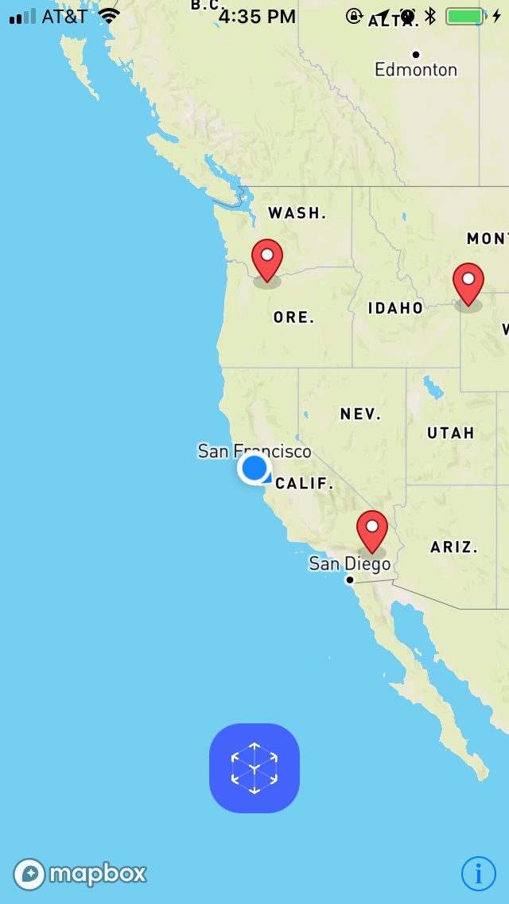

# World-scale AR

### Overview

A world-scale AR demo that shows the location of various national parks and forests in the United States, as well as a 3D horizon and a 2D map for troubleshooting.

### Installation

Install the Mapbox SceneKit using [Carthage](https://github.com/Carthage/Carthage/):

1. Clone this repo.

1. Run `carthage update --platform iOS` to build the iOS dependencies.

1. If necessary, follow instructions 3-5 of [Carthage’s iOS integration instructions](https://github.com/Carthage/Carthage#if-youre-building-for-ios-tvos-or-watchos). Your application target’s Embedded Frameworks should include MapboxSceneKit.framework and MapboxMobileEvents.framework.

1. Add your [access token](https://www.mapbox.com/account/access-tokens/) to the `MGLMapboxAccessToken` field in info.plist.

### Troubleshooting

1. The heading information is sometimes less accurate in dense, urban areas. Refreshing the app may fix this.

### License

worldscale-ar is [licensed under BSD2](https://github.com/mapbox/worldscale-ar/blob/master/LICENSE). Attribution is not required, but definitely welcome! If you build something with this code, please mention it in your readme so that others can learn about the resource.
